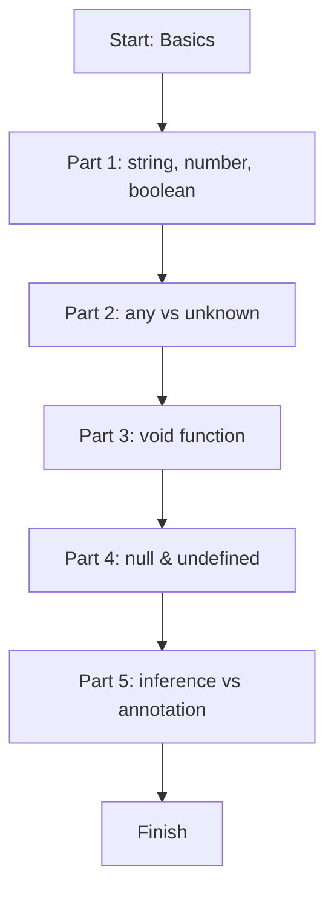

# Module 01: TypeScript Basics

Welcome to your first TypeScript lesson. This module shows the most common types and how TypeScript helps you catch mistakes early.

## Learning Goals

- Understand what TypeScript is
- Use basic types: string, number, boolean
- Know the difference between any and unknown
- Learn void, null, undefined
- See type inference vs type annotation

## What Is TypeScript?

TypeScript is JavaScript with type checking. It lets you describe what kind of data a variable should hold. If you try to use the wrong type, TypeScript warns you before you run the code.

## Lesson Flow (Quick Map)



## Run This Lesson

```bash
npm run build
node dist/01_basics/index.js
```

## Full Example Code (From index.ts)

```ts
console.log("🚀 Starting Module 01: Basics...\n");

// PART 1: Basic Types
{
	const studentName: string = "Ajay Keshri";
	const studentAge: number = 18;
	const likesCoding: boolean = true;

	console.log("--- PART 1: Basic Types ---");
	console.log(`Name: ${studentName} (Type: string)`);
	console.log(`Age: ${studentAge} (Type: number)`);
	console.log(`Loves Coding?: ${likesCoding} (Type: boolean)\n`);
}

// PART 2: Any vs Unknown
{
	console.log("--- PART 2: Any vs Unknown ---");

	let anythingValue: any = "Hello";
	anythingValue = 99;
	console.log("any value:", anythingValue);

	let safeUnknown: unknown = "typescript is awesome";

	if (typeof safeUnknown === "string") {
		console.log("unknown after check:", safeUnknown.toUpperCase());
	}
	console.log("\n");
}

// PART 3: Void
{
	console.log("--- PART 3: Void Function ---");

	function sayHi(name: string): void {
		console.log(`Hi, ${name}! I return nothing (void).`);
	}

	sayHi("Ajay");
	console.log("\n");
}

// PART 4: Null and Undefined
{
	console.log("--- PART 4: Null & Undefined ---");

	let emptyValue: null = null;
	let notReadyYet: undefined = undefined;

	console.log("Null value:", emptyValue);
	console.log("Undefined value:", notReadyYet);
	console.log("\n");
}

// PART 5: Inference vs Annotation
{
	console.log("--- PART 5: Inference vs Annotation ---");

	let city = "Delhi";
	let year = 2026;

	let hobby: string = "Programming";

	console.log(`City: ${city}, Year: ${year}, Hobby: ${hobby}`);
}

console.log("\n✅ Module 01 completed!\n");
```

## Easy Breakdown (Very Simple)

### Part 1: string, number, boolean

- `string` is text like "Ajay Keshri"
- `number` is 18
- `boolean` is true or false

### Part 2: any vs unknown

- `any` lets you put anything, no checks (can cause bugs)
- `unknown` is safer because you must check the type first

### Part 3: void

- `void` is for a function that returns nothing

### Part 4: null and undefined

- `null` means "empty on purpose"
- `undefined` means "not set yet"

### Part 5: inference vs annotation

- Inference: TypeScript guesses the type
- Annotation: You write the type yourself

## Mini Table of Types

| Type | Example | Meaning |
| --- | --- | --- |
| string | "Ajay Keshri" | Text data |
| number | 18 | Numbers |
| boolean | true | True or false |
| any | "Hello", 99 | No checking (avoid) |
| unknown | "hi" | Must check before use |
| void | function returns nothing | No return value |
| null | null | Empty on purpose |
| undefined | undefined | Not set yet |

## Beginner Tip

Use `unknown` instead of `any` when possible. It is safer because you must check the type before using it.

## Small Practice

Create three variables:

- `yourName` as string
- `yourAge` as number
- `likesTea` as boolean

Example:

```ts
const yourName: string = "Ajay Keshri";
const yourAge: number = 18;
const likesTea: boolean = true;
```
