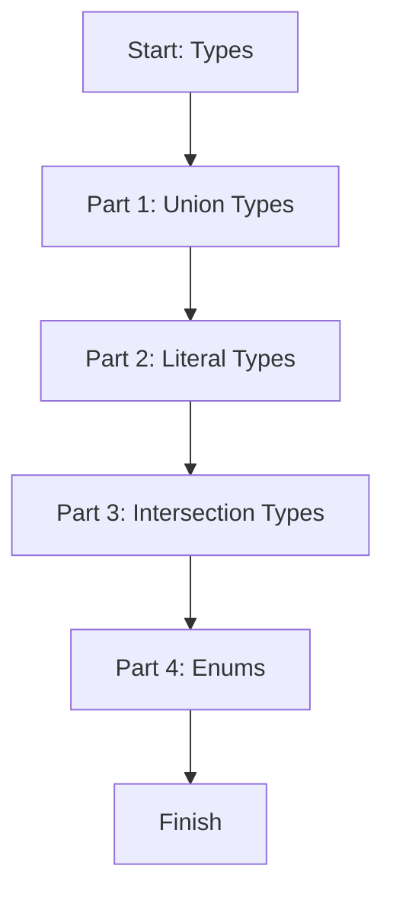

# Module 02: TypeScript Types

This lesson explains the most useful TypeScript type tools in a very simple way: union, literal, intersection, and enum.

## Learning Goals

- Use union types for OR logic
- Use literal types for fixed values
- Combine types with intersections
- Understand enums as named constants

## Lesson Flow



## Run This Lesson

```bash
npm run build
node dist/02_types/index.js
```

## Full Example Code (From index.ts)

```ts
console.log("🚀 Starting Module 02: Types...\n");

// PART 1: Union Types
{
	type Id = string | number;

	let userId: Id = 101;
	console.log("userId (Number):", userId);

	userId = "EMP-101";
	console.log("userId (String):", userId);
	console.log("\n");
}

// PART 2: Literal Types
{
	type UserRole = "student" | "teacher" | "admin";

	let role: UserRole = "student";
	console.log("Assigned Role:", role);
	console.log("\n");
}

// PART 3: Intersection Types
{
	type BasicPerson = { name: string };
	type ContactInfo = { phone: string };

	type FullProfile = BasicPerson & ContactInfo;

	const userProfile: FullProfile = {
		name: "Ajay Keshri",
		phone: "+91 99999 99999",
	};

	console.log("Combines profile object:", userProfile);
	console.log("\n");
}

// PART 4: Enums
{
	enum Direction {
		Up = "UP",
		Down = "DOWN",
		Left = "LEFT",
		Right = "RIGHT"
	}

	let currentMove: Direction = Direction.Up;
	console.log("Player is moving:", currentMove);
}

console.log("\n✅ Module 02 completed!\n");
```

## Easy Breakdown (Very Simple)

### Part 1: Union Types (OR)

- `string | number` means the value can be a string or a number
- Useful when an ID can be numeric or text

### Part 2: Literal Types (Fixed Choices)

- A variable can only be one of the exact values
- Great for roles, modes, or flags

### Part 3: Intersection Types (AND)

- Combine two object types into one
- The final type must have all fields from both

### Part 4: Enums (Named Constants)

- Create a list of fixed named values
- Easy to read and safe to use

## Mini Table of Types

| Type Tool | Example | Meaning |
| --- | --- | --- |
| Union | `string | number` | OR: one of many types |
| Literal | `"student" | "teacher"` | Only exact values |
| Intersection | `A & B` | AND: combine object types |
| Enum | `Direction.Up` | Named constant value |

## Beginner Tip

Use literal types for strict options, and union types for flexible inputs.

## Small Practice

Create a type named `PaymentMode` with only three values:

- "cash"
- "card"
- "upi"

Example:

```ts
type PaymentMode = "cash" | "card" | "upi";

let mode: PaymentMode = "upi";
```
