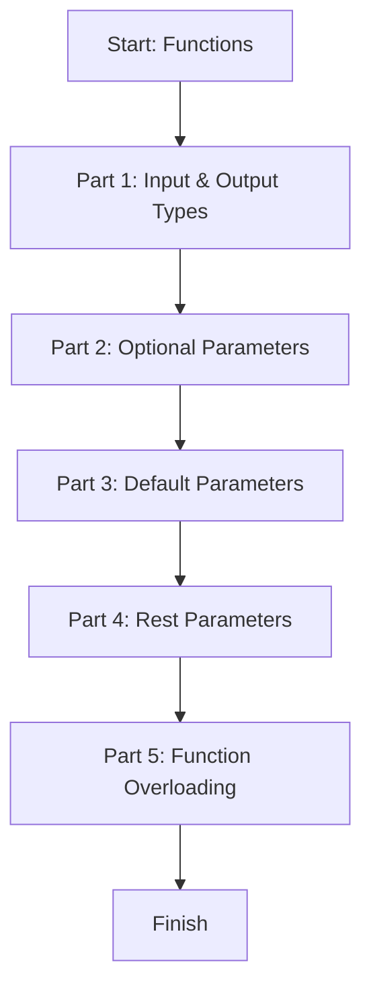

# Module 03: TypeScript Functions

This lesson shows how to type functions clearly: inputs, outputs, optional values, defaults, rest parameters, and overloads.

## Learning Goals

- Write typed functions
- Use optional parameters with `?`
- Set default parameter values
- Accept multiple values using rest parameters
- Use function overloading for multiple input types

## Lesson Flow



## Run This Lesson

```bash
npm run build
node dist/03_functions/index.js
```

## Full Example Code (From index.ts)

```ts
console.log("🚀 Starting Module 03: Functions...\n");

// PART 1: Basic Function Formatting
{
	function addNumbers(a: number, b: number): number {
		return a + b;
	}

	console.log("Adding 5 + 3 =", addNumbers(5, 3));
	console.log("\n");
}

// PART 2: Optional Parameters
{
	function greet(name: string, title?: string): string {
		if (title) {
			return `Hello, ${title} ${name}!`;
		}
		return `Hello, ${name}!`;
	}

	console.log(greet("Ajay Keshri"));
	console.log(greet("Ajay Keshri", "Mr."));
	console.log("\n");
}

// PART 3: Default Parameters
{
	function welcome(city: string = "Delhi"): string {
		return `Welcome to ${city}!`;
	}

	console.log(welcome());
	console.log(welcome("Mumbai"));
	console.log("\n");
}

// PART 4: Rest Parameters
{
	function sumAll(...numbers: number[]): number {
		return numbers.reduce((sum, num) => sum + num, 0);
	}

	console.log("Summing 10, 20, 30 =", sumAll(10, 20, 30));
	console.log("\n");
}

// PART 5: Function Overloading
{
	function formatData(value: number): string;
	function formatData(value: string): string;

	function formatData(value: number | string): string {
		if (typeof value === "number") {
			return `[Number Value]: ${value.toFixed(2)}`;
		}
		return `[Text Value]: ${value.toUpperCase()}`;
	}

	console.log(formatData(99.456));
	console.log(formatData("typescript is powerful"));
}

console.log("\n✅ Module 03 completed!\n");
```

## Easy Breakdown (Very Simple)

### Part 1: Input & Output Types

- Write the input types inside the function
- Write the return type after the parentheses

### Part 2: Optional Parameters

- Add `?` to make a parameter optional
- Check if it exists before using

### Part 3: Default Parameters

- Set a default value inside the parameter list
- If no value is passed, the default is used

### Part 4: Rest Parameters

- Use `...numbers` to accept many values
- It becomes an array automatically

### Part 5: Function Overloading

- Same function name, different input types
- Use multiple signatures and one implementation

## Mini Table of Function Tools

| Feature | Example | Meaning |
| --- | --- | --- |
| Typed inputs/outputs | `function add(a: number): number` | Inputs and return are typed |
| Optional parameter | `title?: string` | Parameter is optional |
| Default parameter | `city = "Delhi"` | Uses default if missing |
| Rest parameter | `...numbers: number[]` | Many values as array |
| Overload | `function f(x: number): string;` | Different allowed inputs |

## Beginner Tip

Always type the inputs first. TypeScript can often infer the return type, but writing it makes your intent clear.

## Small Practice

Create a function named `squareNumber` that takes a number and returns a number.

Example:

```ts
function squareNumber(value: number): number {
	return value * value;
}
```
