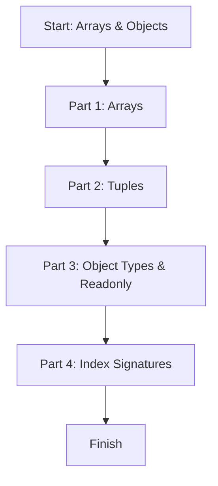

# Module 04: Arrays and Objects

This lesson teaches how to type lists and structured data: arrays, tuples, object types, readonly properties, and index signatures.

## Learning Goals

- Create typed arrays
- Use tuples for fixed-size data
- Define object shapes with optional and readonly fields
- Use index signatures for dynamic keys

## Lesson Flow



## Run This Lesson

```bash
npm run build
node dist/04_arrays_objects/index.js
```

## Full Example Code (From index.ts)

```ts
console.log("🚀 Starting Module 04: Arrays & Objects...\n");

// PART 1: Arrays
{
	const scores: number[] = [90, 85, 100];
	const names: Array<string> = ["Ajay", "Vijay"];
	console.log("Scores:", scores);
	console.log("Names:", names, "\n");
}

// PART 2: Tuples
{
	const userRecord: [number, string, boolean] = [1, "Ajay Keshri", true];
	console.log("Tuple record:", userRecord, "\n");
}

// PART 3: Object Types & Readonly
{
	type Car = {
		readonly brand: string;
		model: string;
		year?: number;
	};

	const myCar: Car = { brand: "Tata", model: "Nexon" };
	// myCar.brand = "Mahindra"; // Error: Cannot assign to 'brand'
	myCar.model = "Harrier";

	console.log("Car Object:", myCar, "\n");
}

// PART 4: Index Signatures
{
	type Dictionary = {
		[key: string]: string;
	};

	const translations: Dictionary = {
		hello: "namaste",
		world: "duniya"
	};

	console.log("Dictionary:", translations, "\n");
}

console.log("✅ Module 04 completed!\n");
```

## Easy Breakdown (Very Simple)

### Part 1: Arrays

- Use `type[]` or `Array<type>`
- All items must be the same type

### Part 2: Tuples

- A tuple has a fixed length
- Each position has a fixed type

### Part 3: Object Types & Readonly

- Define object shape with `type`
- `readonly` means it cannot be changed
- `?` means optional

### Part 4: Index Signatures

- Use when keys are not known ahead of time
- All keys and values share the same type

## Mini Table of Structured Types

| Type Tool | Example | Meaning |
| --- | --- | --- |
| Array | `number[]` | List of numbers |
| Tuple | `[number, string]` | Fixed size + fixed order |
| Object type | `{ brand: string }` | Exact object shape |
| Readonly | `readonly brand: string` | Cannot be changed |
| Index signature | `[key: string]: string` | Dynamic keys |

## Beginner Tip

Use a tuple when the order matters, like `[id, name, isActive]`.

## Small Practice

Create an array named `favoriteMovies` with 3 movie names.

Example:

```ts
const favoriteMovies: string[] = ["3 Idiots", "Dangal", "Drishyam"];
```
