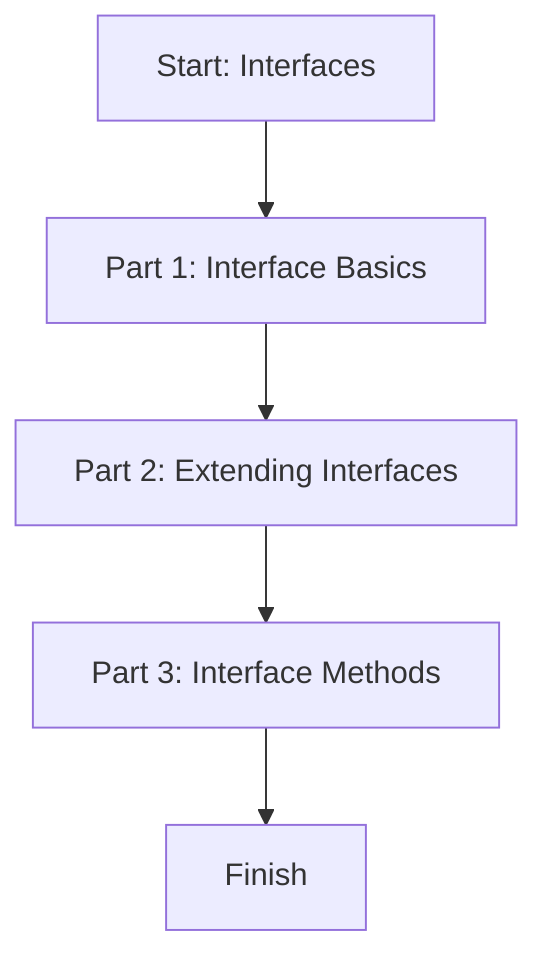

# Module 05: Interfaces

This lesson teaches how to use interfaces to describe object shapes, extend them, and add methods.

## Learning Goals

- Create simple interfaces
- Extend one interface from another
- Add methods inside interfaces
- Understand when to use `interface` vs `type`

## Lesson Flow



## Run This Lesson

```bash
npm run build
node dist/05_interfaces/index.js
```

## Full Example Code (From index.ts)

```ts
console.log("🚀 Starting Module 05: Interfaces...\n");

// PART 1: Interface Basics
{
	interface Book {
		title: string;
		price: number;
	}

	const myBook: Book = { title: "TypeScript Mastery", price: 500 };
	console.log("Book Object:", myBook, "\n");
}

// PART 2: Extending Interfaces
{
	interface User {
		name: string;
	}

	interface Admin extends User {
		role: string;
	}

	const superAdmin: Admin = { name: "Ajay", role: "SuperAdmin" };
	console.log("Admin Object:", superAdmin, "\n");
}

// PART 3: Interface Methods
{
	interface Animal {
		name: string;
		makeSound(): void;
	}

	const dog: Animal = {
		name: "Buddy",
		makeSound() {
			console.log("Woof woof!");
		}
	};

	dog.makeSound();
	console.log("\n");
}

console.log("✅ Module 05 completed!\n");
```

## Easy Breakdown (Very Simple)

### Part 1: Interface Basics

- An interface describes the shape of an object
- Objects must match all required fields

### Part 2: Extending Interfaces

- `extends` lets one interface inherit another
- The new interface has all parent fields plus its own

### Part 3: Interface Methods

- Interfaces can include function signatures
- The object must provide that function

## Mini Table of Interface Features

| Feature | Example | Meaning |
| --- | --- | --- |
| Basic interface | `interface Book { title: string }` | Describes object shape |
| Extend | `interface Admin extends User` | Inherits fields |
| Methods | `makeSound(): void` | Object must implement method |

## Interface vs Type (Simple Rule)

- Use `interface` for object shapes
- Use `type` for unions and special combinations

Both are useful.

## Beginner Tip

If your data looks like an object, start with `interface`.

## Small Practice

Create an interface named `Book` with `title` and `price`.

Example:

```ts
interface Book {
	title: string;
	price: number;
}
```
