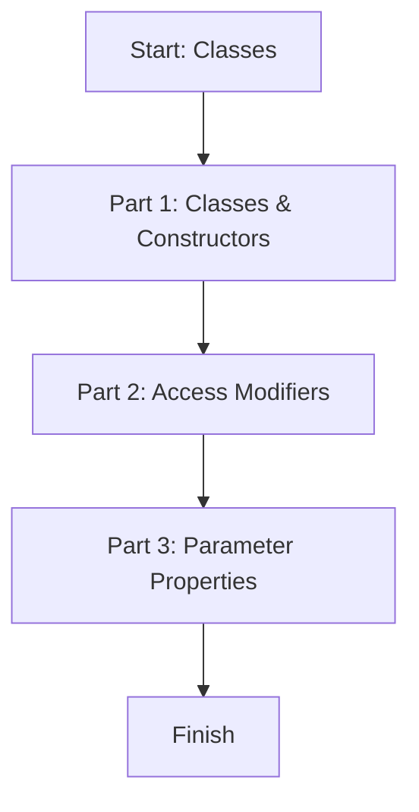

# Module 06: Classes

This lesson introduces TypeScript classes with constructors, access modifiers, and parameter properties.

## Learning Goals

- Create a class and constructor
- Use access modifiers (public, private, protected)
- Use parameter properties for shorter code

## Lesson Flow



## Run This Lesson

```bash
npm run build
node dist/06_classes/index.js
```

## Full Example Code (From index.ts)

```ts
console.log("🚀 Starting Module 06: Classes...\n");

// PART 1: Classes & Constructors
{
	class Greeting {
		message: string;
		constructor(msg: string) {
			this.message = msg;
		}
		sayHello() {
			console.log(this.message);
		}
	}

	const greet = new Greeting("Hello TypeScript!");
	greet.sayHello();
	console.log("\n");
}

// PART 2: Access Modifiers
{
	class BankAccount {
		public owner: string;
		private balance: number;

		constructor(owner: string, initialBalance: number) {
			this.owner = owner;
			this.balance = initialBalance;
		}

		public getBalance(): number {
			return this.balance;
		}
	}

	const account = new BankAccount("Ajay", 1000);
	console.log(`${account.owner}'s Balance: ${account.getBalance()}\n`);
}

// PART 3: Parameter Properties
{
	class Player {
		constructor(public name: string, private score: number) {}

		getScore() { return this.score; }
	}

	const p1 = new Player("Virat", 100);
	console.log(`Player: ${p1.name}, Score: ${p1.getScore()}\n`);
}

console.log("✅ Module 06 completed!\n");
```

## Easy Breakdown (Very Simple)

### Part 1: Classes & Constructors

- A class is a blueprint for objects
- The constructor runs when you create a new object

### Part 2: Access Modifiers

- `public`: can be accessed anywhere
- `private`: only inside the class
- `protected`: class + subclasses

### Part 3: Parameter Properties

- Shorter way to declare and assign fields
- Put `public` or `private` directly in the constructor

## Mini Table of Class Features

| Feature | Example | Meaning |
| --- | --- | --- |
| Class | `class Greeting {}` | Blueprint for objects |
| Constructor | `constructor(msg: string)` | Runs on `new` |
| Access modifiers | `private balance` | Controls access |
| Parameter properties | `constructor(public name: string)` | Auto field setup |

## Beginner Tip

Start with `public` fields, then add `private` only when you want to protect data.

## Small Practice

Create a class `Car` with `name` and `speed`. Add a method named `drive`.

Example:

```ts
class Car {
	constructor(public name: string, public speed: number) {}

	drive() {
		console.log(`${this.name} is driving at ${this.speed} km/h`);
	}
}
```
