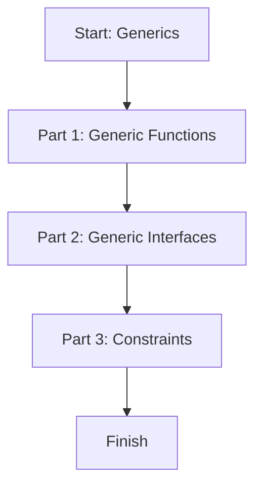

# 📖 Module 07: Generics

Learn how to write reusable and type-safe code using generics.

## 🎯 Topics Covered

- Generic functions
- Generic interfaces
- Generic constraints

## 🧠 Key Idea (Very Simple)

Generics let you write one function or type that works with many data types, while still keeping TypeScript safe.

## ❓ What Is It?

Generics are type placeholders (like `T`) that you fill in later. They make code flexible without losing type safety.

## ✅ Why Use It?

- Reuse the same logic for numbers, strings, objects, and more.
- Get strong type checking without writing many duplicate functions.
- Keep code clean, readable, and scalable.

## 🗺️ Lesson Flow



## 🧩 Full Example Code (From index.ts)

```ts
console.log("🚀 Starting Module 07: Generics...\n");

// PART 1: Generic Functions
{
	function identity<T>(value: T): T {
		return value;
	}

	console.log("Number identity:", identity<number>(42));
	console.log("String identity:", identity<string>("TS is awesome"), "\n");
}

// PART 2: Generic Interfaces
{
	interface Box<Type> {
		contents: Type;
	}

	const stringBox: Box<string> = { contents: "Hello Box" };
	const numberBox: Box<number> = { contents: 999 };

	console.log("String box:", stringBox.contents);
	console.log("Number box:", numberBox.contents, "\n");
}

// PART 3: Constraints
{
	interface HasLength {
		length: number;
	}

	function logLength<T extends HasLength>(item: T): void {
		console.log(`Length is: ${item.length}`);
	}

	logLength("Hello");
	logLength([1, 2, 3]);
	// logLength(123); // Error: number has no length
	console.log("\n");
}

console.log("✅ Module 07 completed!\n");
```

## 📌 Quick Reference Table

| Concept | Syntax | What It Means | Example |
| --- | --- | --- | --- |
| Generic function | `function fn<T>(x: T): T` | Reusable function for any type | `identity<number>(42)` |
| Generic interface | `interface Box<T> { contents: T }` | Reusable structure with type | `Box<string>` |
| Constraint | `T extends HasLength` | Limit which types are allowed | `logLength("hello")` |

## ✅ Easy Breakdown (Super Simple)

### Part 1: Generic Functions

- Write one function that works for any type.
- `T` is a placeholder for the real type.

Example:

```ts
function identity<T>(value: T): T {
	return value;
}

identity<number>(42);
identity<string>("TS is awesome");
```

### Part 2: Generic Interfaces

- Make a reusable shape.
- You decide the type when you use it.

Example:

```ts
interface Box<Type> {
	contents: Type;
}

const stringBox: Box<string> = { contents: "Hello Box" };
```

### Part 3: Constraints

- Sometimes you only want types that have certain properties.
- `extends` lets you restrict what types are allowed.

Example:

```ts
interface HasLength {
	length: number;
}

function logLength<T extends HasLength>(item: T): void {
	console.log(item.length);
}

logLength("Hello");
logLength([1, 2, 3]);
```

## 🧪 Small Practice

Create a generic function `firstItem` that returns the first value of an array.

Starter:

```ts
function firstItem<T>(items: T[]): T {
	return items[0];
}
```

## 🚀 Run This Lesson

```bash
npm run build
node dist/07_generics/index.js
```
