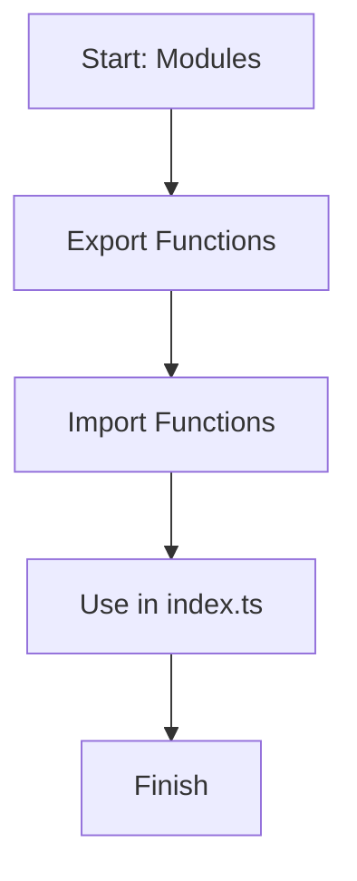

# 📖 Module 08: Modules

Learn how to split code into files and share logic using `export` and `import`.

## 🎯 Topics Covered

- Exporting functions
- Importing functions
- Using relative paths like `./mathHelpers`

## 🧠 Key Idea (Very Simple)

Modules let you keep code organized. Write logic in one file, export it, and use it anywhere.

## 🗺️ Lesson Flow



## 🧩 Full Example Code (From index.ts)

```ts
import { add, subtract } from "./mathHelpers";
import { shout } from "./stringHelpers";

console.log("🚀 Starting Module 08: Modules...\n");

{
	const sum = add(10, 5);
	const difference = subtract(10, 5);
	const loudText = shout("modules are simple");

	console.log(`Sum of 10 and 5: ${sum}`);
	console.log(`Difference between 10 and 5: ${difference}`);
	console.log(`Shouted text: ${loudText}\n`);
}

console.log("✅ Module 08 completed!\n");
```

## 📌 Quick Reference Table

| Task | Syntax | Example |
| --- | --- | --- |
| Export a function | `export function name(...) {}` | `export function add(a: number, b: number): number {}` |
| Import a function | `import { name } from "./file"` | `import { add } from "./mathHelpers"` |
| Use imported code | `name(...)` | `add(10, 5)` |

## ✅ Easy Breakdown (Super Simple)

### 1) Export from another file

```ts
export function add(a: number, b: number): number {
	return a + b;
}
```

### 2) Import into your main file

```ts
import { add } from "./mathHelpers";
```

### 3) Use the function

```ts
const result = add(10, 5);
```

## 🔎 Folder Snapshot

```
08_modules/
	index.ts
	mathHelpers.ts
	stringHelpers.ts
```

## 🛠️ Small Practice

Create a new file `greetHelpers.ts` with a function `greet(name: string)` and import it into `index.ts`.

Example:

```ts
// greetHelpers.ts
export function greet(name: string): string {
	return `Hello, ${name}!`;
}

// index.ts
import { greet } from "./greetHelpers";
console.log(greet("Ajay"));
```

## 🚀 Run This Lesson

```bash
npm run build
node dist/08_modules/index.js
```
