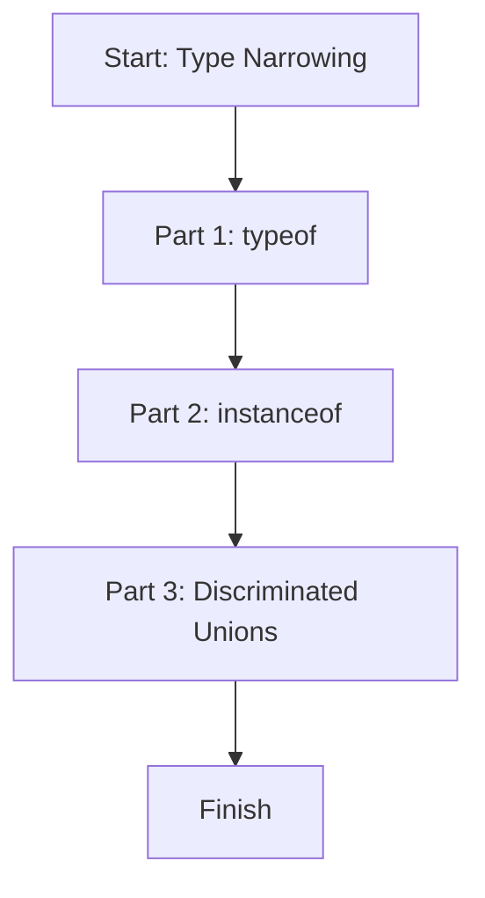

# 📖 Module 09: Type Narrowing

Learn how TypeScript figures out the exact type after checks like `typeof`, `instanceof`, and discriminated unions.

## 🎯 Topics Covered

- `typeof` narrowing
- `instanceof` narrowing
- Discriminated unions

## 🧠 Key Idea (Very Simple)

Narrowing means taking a wide type (like `string | number`) and making it specific after a check.

## 🗺️ Lesson Flow



## 🧩 Full Example Code (From index.ts)

```ts
console.log("🚀 Starting Module 09: Type Narrowing...\n");

// PART 1: typeof Narrowing
{
	function printValue(value: string | number): void {
		if (typeof value === "string") {
			console.log("String value:", value.toUpperCase());
		} else {
			console.log("Number value:", value.toFixed(2));
		}
	}

	printValue("hello");
	printValue(12.456);
	console.log("\n");
}

// PART 2: instanceof Narrowing
{
	class Cat { meow() { return "meow"; } }
	class Dog { bark() { return "woof"; } }

	function petSound(pet: Cat | Dog): void {
		if (pet instanceof Cat) {
			console.log("Cat says:", pet.meow());
		} else {
			console.log("Dog says:", pet.bark());
		}
	}

	petSound(new Cat());
	petSound(new Dog());
	console.log("\n");
}

// PART 3: Discriminated Unions
{
	type Circle = { kind: "circle"; radius: number };
	type Square = { kind: "square"; side: number };
	type Shape = Circle | Square;

	function getArea(shape: Shape): number {
		if (shape.kind === "circle") {
			return Math.PI * shape.radius * shape.radius;
		}
		return shape.side * shape.side;
	}

	console.log("Circle area:", getArea({ kind: "circle", radius: 2 }).toFixed(2));
	console.log("Square area:", getArea({ kind: "square", side: 4 }));
	console.log("\n");
}

console.log("✅ Module 09 completed!\n");
```

## 📌 Quick Reference Table

| Technique | Check | What It Does | Example |
| --- | --- | --- | --- |
| `typeof` | `typeof value === "string"` | Narrow primitives | `string | number` -> `string` |
| `instanceof` | `pet instanceof Cat` | Narrow class types | `Cat | Dog` -> `Cat` |
| Discriminated union | `shape.kind === "circle"` | Narrow by literal field | `Shape` -> `Circle` |

## ✅ Easy Breakdown (Super Simple)

### Part 1: `typeof`

- Use this for primitives like `string`, `number`, `boolean`.
- After the check, TypeScript knows the exact type.

```ts
if (typeof value === "string") {
	value.toUpperCase();
} else {
	value.toFixed(2);
}
```

### Part 2: `instanceof`

- Use this for class objects.
- It checks what class the object was created from.

```ts
if (pet instanceof Cat) {
	pet.meow();
} else {
	pet.bark();
}
```

### Part 3: Discriminated Unions

- Use a shared property (like `kind`) with fixed text values.
- That property decides the exact type.

```ts
if (shape.kind === "circle") {
	return Math.PI * shape.radius * shape.radius;
}
```

## 🧪 Small Practice

Create a function that accepts `string | boolean` and prints different output.

Example:

```ts
function showValue(value: string | boolean): void {
	if (typeof value === "string") {
		console.log(value.toUpperCase());
	} else {
		console.log(value ? "TRUE" : "FALSE");
	}
}
```

## 🚀 Run This Lesson

```bash
npm run build
node dist/09_type_narrowing/index.js
```
