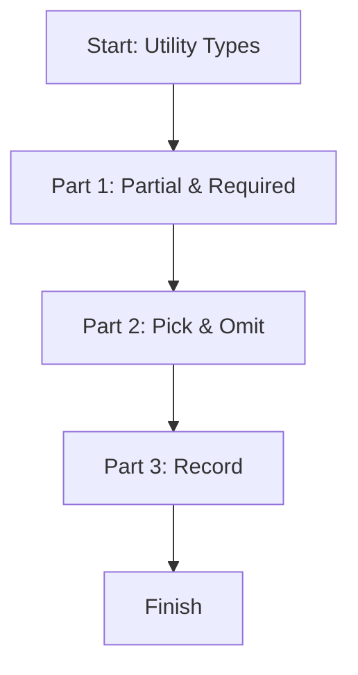

# 📖 Module 10: Utility Types

Learn how to transform types using TypeScript's built-in utility types.

## 🎯 Topics Covered

- `Partial`
- `Required`
- `Pick`
- `Omit`
- `Record`

## 🧠 Key Idea (Very Simple)

Utility types let you build new types from existing ones without rewriting everything.

## ❓ What Is It?

Utility types are built-in TypeScript helpers that transform one type into another.

## ✅ Why Use It?

- Avoid repeating type definitions.
- Keep types consistent across your project.
- Make updates easier when a base type changes.

## 🗺️ Lesson Flow



## 🧩 Full Example Code (From index.ts)

```ts
console.log("🚀 Starting Module 10: Utility Types...\n");

type User = {
	id: number;
	name: string;
	email: string;
};

// PART 1: Partial & Required
{
	const draftUser: Partial<User> = { name: "Ajay Keshri" };
	const fullUser: Required<User> = { id: 1, name: "Ajay", email: "ajay@abc.com" };

	console.log("Draft User:", draftUser);
	console.log("Full User:", fullUser, "\n");
}

// PART 2: Pick & Omit
{
	type UserNameOnly = Pick<User, "name">;
	const nameOnly: UserNameOnly = { name: "Aditya" };

	type UserWithoutEmail = Omit<User, "email">;
	const noEmailUser: UserWithoutEmail = { id: 3, name: "Sumit" };

	console.log("Picked Name:", nameOnly);
	console.log("Omitted Email:", noEmailUser, "\n");
}

// PART 3: Record
{
	const scoreBoard: Record<string, number> = {
		ajayKeshri: 90,
		vijay: 95,
	};

	console.log("Score Board:", scoreBoard, "\n");
}

console.log("✅ Module 10 completed!\n");
```

## 📌 Quick Reference Table

| Utility Type | What It Does | Example |
| --- | --- | --- |
| `Partial<T>` | Makes all fields optional | `Partial<User>` |
| `Required<T>` | Makes all fields required | `Required<User>` |
| `Pick<T, K>` | Keeps only selected keys | `Pick<User, "name">` |
| `Omit<T, K>` | Removes selected keys | `Omit<User, "email">` |
| `Record<K, V>` | Creates a key-value map | `Record<string, number>` |

## ✅ Easy Breakdown (Super Simple)

### Part 1: `Partial` and `Required`

- `Partial` makes every field optional.
- `Required` makes every field mandatory.

```ts
const draftUser: Partial<User> = { name: "Ajay Keshri" };
const fullUser: Required<User> = { id: 1, name: "Ajay", email: "ajay@abc.com" };
```

### Part 2: `Pick` and `Omit`

- `Pick` keeps only the fields you want.
- `Omit` removes the fields you do not want.

```ts
type UserNameOnly = Pick<User, "name">;
type UserWithoutEmail = Omit<User, "email">;
```

### Part 3: `Record`

- `Record` is perfect for dictionary-like objects.

```ts
const scoreBoard: Record<string, number> = {
	ajayKeshri: 90,
	vijay: 95,
};
```

## 🧪 Small Practice

Create a new type from `User` that only has `id` and `email`.

Example:

```ts
type UserIdEmail = Pick<User, "id" | "email">;
```

## 🚀 Run This Lesson

```bash
npm run build
node dist/10_utility_types/index.js
```
