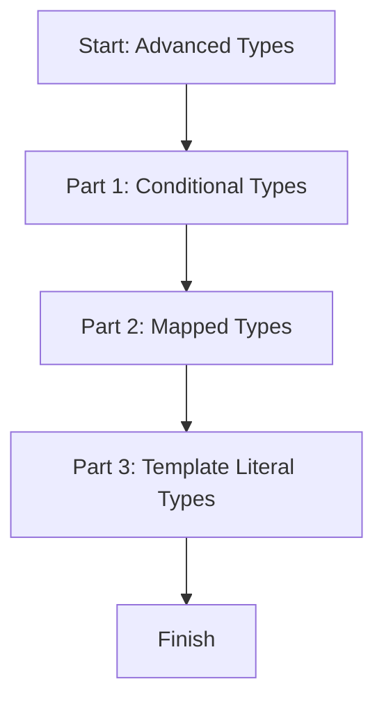

# 📖 Module 11: Advanced Types

Learn conditional, mapped, and template literal types in a simple and visual way.

## 🎯 Topics Covered

- Conditional types
- Mapped types
- Template literal types

## 🧠 Key Idea (Very Simple)

Advanced types help you build new types from old ones using rules and patterns.

## ❓ What Is It?

Advanced types are powerful TypeScript features that let you transform or generate types based on logic.

## ✅ Why Use It?

- Create flexible, reusable type rules.
- Reduce repetitive type definitions.
- Keep code safe when shapes or strings must follow strict patterns.

## 🗺️ Lesson Flow



## 🧩 Full Example Code (From index.ts)

```ts
console.log("🚀 Starting Module 11: Advanced Types...\n");

// PART 1: Conditional Types
{
	type IsString<T> = T extends string ? "yes" : "no";

	const checkOne: IsString<string> = "yes";
	const checkTwo: IsString<number> = "no";
	console.log("Is string check mapping:", checkOne, checkTwo, "\n");
}

// PART 2: Mapped Types
{
	type Settings = { darkMode: boolean; notifications: boolean };

	type NullableSettings = {
		[Key in keyof Settings]: Settings[Key] | null;
	};

	const appSettings: NullableSettings = {
		darkMode: true,
		notifications: null,
	};

	console.log("Mapped Nullable Settings:", appSettings, "\n");
}

// PART 3: Template Literal Types
{
	type EventName<T extends string> = `on${Capitalize<T>}`;

	type LoginEvent = EventName<"login">;
	const loginEventName: LoginEvent = "onLogin";

	console.log("Template Literal generated type string:", loginEventName, "\n");
}

console.log("✅ Module 11 completed!\n");
```

## 📌 Quick Reference Table

| Feature | What It Does | Example |
| --- | --- | --- |
| Conditional type | Chooses a type based on a condition | `T extends string ? "yes" : "no"` |
| Mapped type | Transforms each key in a type | `{ [K in keyof T]: ... }` |
| Template literal type | Builds string types from patterns | `` `on${Capitalize<T>}` `` |

## ✅ Easy Breakdown (Super Simple)

### Part 1: Conditional Types

- It works like a ternary operator, but for types.
- Result depends on the type you pass.

```ts
type IsString<T> = T extends string ? "yes" : "no";
```

### Part 2: Mapped Types

- It loops over each key and changes the value type.

```ts
type NullableSettings = {
	[Key in keyof Settings]: Settings[Key] | null;
};
```

### Part 3: Template Literal Types

- It builds string types like templates.

```ts
type EventName<T extends string> = `on${Capitalize<T>}`;
```

## 🧪 Small Practice

Create a template literal type for event name `onSave`.

Example:

```ts
type SaveEvent = EventName<"save">; // "onSave"
```

## 🚀 Run This Lesson

```bash
npm run build
node dist/11_advanced_types/index.js
```
