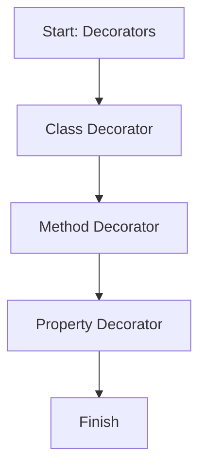

# 📖 Module 12: Decorators

Learn how decorators add extra behavior to classes, methods, and properties.

## 🎯 Topics Covered

- Class decorators
- Method decorators
- Property decorators

## 🧠 Key Idea (Very Simple)

A decorator is a function that runs around a class, method, or property to add behavior automatically.

## ❓ What Is It?

Decorators are a special TypeScript feature that let you attach logic to classes and their members.

## ✅ Why Use It?

- Add logging or validation without changing business logic.
- Keep code clean and reusable.
- Apply the same behavior in many places with one decorator.

## 🗺️ Lesson Flow



## 🧩 Full Example Code (From index.ts)

```ts
console.log("🚀 Starting Module 12: Decorators...\n");

// Class decorator
function sealed(constructor: Function): void {
	Object.seal(constructor);
	Object.seal(constructor.prototype);
}

// Method decorator
function logCall(_target: object, methodName: string, descriptor: PropertyDescriptor): void {
	const originalMethod = descriptor.value as (...args: unknown[]) => unknown;
	descriptor.value = function (...args: unknown[]): unknown {
		console.log(`[LOG] Calling method '${methodName}' with args:`, args);
		return originalMethod.apply(this, args);
	};
}

// Property decorator
function maxLength(limit: number) {
	return function (target: object, propertyKey: string): void {
		let internalValue = "";
		Object.defineProperty(target, propertyKey, {
			get() { return internalValue; },
			set(newValue: string) {
				internalValue = newValue.length > limit ? newValue.slice(0, limit) : newValue;
			},
		});
	};
}

@sealed
class NoticeBoard {
	@maxLength(20)
	title = "";

	@logCall
	post(message: string): string {
		return "Notice: " + message;
	}
}

const board = new NoticeBoard();
board.title = "TypeScript decorators are extremely useful for real software";

console.log("Restricted Title:", board.title);
console.log("Method Return:", board.post("Class starts at 10"));
console.log("\n");

console.log("✅ Module 12 completed!\n");
```

## 📌 Quick Reference Table

| Decorator Type | Applied To | Example | Effect |
| --- | --- | --- | --- |
| Class | `class` | `@sealed` | Locks class changes |
| Method | `method()` | `@logCall` | Logs each method call |
| Property | `field` | `@maxLength(20)` | Caps string length |

## ✅ Easy Breakdown (Super Simple)

### Class Decorator

- Runs once when the class is defined.
- Can lock or modify the class.

```ts
@sealed
class NoticeBoard {}
```

### Method Decorator

- Runs when the method is called.
- Can wrap the original method.

```ts
@logCall
post(message: string): string {
	return "Notice: " + message;
}
```

### Property Decorator

- Runs when a property is set.
- Can validate or change the stored value.

```ts
@maxLength(20)
title = "";
```

## 📝 Note

Decorators are optional. Many beginners can skip this once and return later.

## 🧪 Small Practice

Create a decorator `@uppercase` that always stores a string in uppercase.

Example:

```ts
function uppercase() {
	return function (target: object, propertyKey: string): void {
		let value = "";
		Object.defineProperty(target, propertyKey, {
			get() { return value; },
			set(newValue: string) { value = newValue.toUpperCase(); },
		});
	};
}
```

## 🚀 Run This Lesson

```bash
npm run build
node dist/12_decorators/index.js
```
