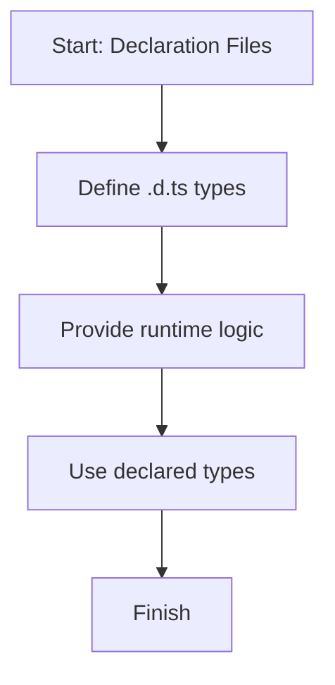

# 📖 Module 13: Declaration Files

Learn how `.d.ts` files provide type information for global or external code.

## 🎯 Topics Covered

- `.d.ts` basics
- Using external or global types

## 🧠 Key Idea (Very Simple)

Declaration files describe types only. They do not include runtime code.

## ❓ What Is It?

A declaration file (`.d.ts`) tells TypeScript what functions, classes, or namespaces exist so you get type safety even when the real code lives elsewhere.

## ✅ Why Use It?

- Type safety for global scripts or third-party libraries.
- Better autocomplete and error checking.
- Clean separation: types in `.d.ts`, logic in `.ts`.

## 🗺️ Lesson Flow



## 🧩 Full Example Code (From index.ts)

```ts
console.log("🚀 Starting Module 13: Declaration Files...\n");

{
	// Injecting runtime logic for our fake global 'makeLoud' function
	(globalThis as any).makeLoud = (text: string): string => {
		return text.toUpperCase();
	};

	const loudText = makeLoud("typescript .d.ts is cool");

	const apiUser: ApiTypes.User = {
		id: 1,
		name: "Ajay Keshri",
	};

	console.log("Used Global function makeLoud():", loudText);
	console.log("Used Global API Type User:", apiUser);
	console.log("\n");
}

console.log("✅ Module 13 completed!\n");
```

## 📌 Quick Reference Table

| Item | Lives In | Purpose | Example |
| --- | --- | --- | --- |
| Declaration | `.d.ts` | Types only | `declare function makeLoud(text: string): string;` |
| Runtime logic | `.ts` | Actual code | `(globalThis as any).makeLoud = ...` |
| Namespace types | `.d.ts` | Structured types | `declare namespace ApiTypes { ... }` |

## ✅ Easy Breakdown (Super Simple)

### Step 1: Declare types in `.d.ts`

```ts
declare function makeLoud(text: string): string;

declare namespace ApiTypes {
	interface User {
		id: number;
		name: string;
	}
}
```

### Step 2: Add runtime implementation in `.ts`

```ts
(globalThis as any).makeLoud = (text: string): string => {
	return text.toUpperCase();
};
```

### Step 3: Use it with full type safety

```ts
const loudText = makeLoud("typescript .d.ts is cool");
const apiUser: ApiTypes.User = { id: 1, name: "Ajay Keshri" };
```

## 🧪 Small Practice

Declare one function in `.d.ts` and provide runtime implementation in `index.ts`.

Example:

```ts
// shout-library.d.ts
declare function shout(text: string): string;

// index.ts
(globalThis as any).shout = (text: string): string => text + "!!!";
```

## 🚀 Run This Lesson

```bash
npm run build
node dist/13_declaration_files/index.js
```
