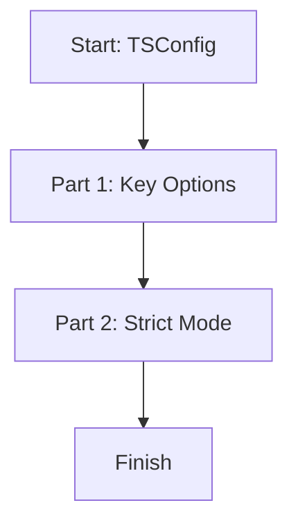

# 📖 Module 14: TSConfig

Learn how `tsconfig.json` controls the TypeScript compiler.

## 🎯 Topics Covered

- Important compiler options
- Strict mode

## 🧠 Key Idea (Very Simple)

`tsconfig.json` tells TypeScript how to check your code and how to build it.

## ❓ What Is It?

TSConfig is a configuration file that defines compiler rules like the target JavaScript version, module system, and strictness level.

## ✅ Why Use It?

- Keep consistent build rules for the whole project.
- Catch errors early with strict type checking.
- Control where source and output files live.

## 🗺️ Lesson Flow



## 🧩 Full Example Code (From index.ts)

```ts
console.log("🚀 Starting Module 14: TSConfig...\n");

// PART 1: The Options
{
	type TsConfigOptions = {
		strict: boolean;
		target: string;
		module: string;
		rootDir: string;
		outDir: string;
	};

	const importantOptions: TsConfigOptions = {
		strict: true,
		target: "esnext",
		module: "commonjs",
		rootDir: "./src",
		outDir: "./dist",
	};

	console.log("Essential Configuration Profile:", importantOptions, "\n");
}

// PART 2: Strict Mode Benefit
{
	function addPrice(price: number, tax: number): number {
		return price + tax;
	}

	console.log(`Add Price (100 + 18 tax): ${addPrice(100, 18)}\n`);
}

console.log("✅ Module 14 completed!\n");
```

## 📌 Quick Reference Table

| Option | What It Controls | Example Value | Meaning |
| --- | --- | --- | --- |
| `strict` | Type-checking rules | `true` | Turns on strict checks |
| `target` | Output JS version | `"esnext"` | Modern JavaScript output |
| `module` | Module system | `"commonjs"` | Node-style imports/exports |
| `rootDir` | Source folder | `"./src"` | Where TS files live |
| `outDir` | Output folder | `"./dist"` | Where JS files go |

## ✅ Easy Breakdown (Super Simple)

### Part 1: Key Options

- You set compiler rules in `tsconfig.json`.
- The most common settings are `strict`, `target`, and `module`.

```ts
const importantOptions = {
	strict: true,
	target: "esnext",
	module: "commonjs",
	rootDir: "./src",
	outDir: "./dist",
};
```

### Part 2: Strict Mode

- Strict mode finds more mistakes early.
- It pushes you to use correct types.

```ts
function addPrice(price: number, tax: number): number {
	return price + tax;
}
```

## 🧪 Small Practice

Add `noImplicitAny: true` to your `tsconfig.json` and see what errors appear.

## 🚀 Run This Lesson

```bash
npm run build
node dist/14_tsconfig/index.js
```
