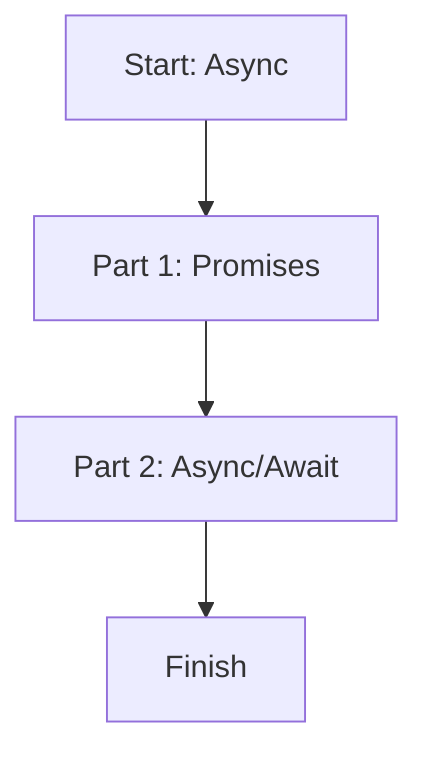

# 📖 Module 15: Async Programming

Learn how to work with asynchronous code using Promises and `async/await`.

## 🎯 Topics Covered

- Promises
- `async` / `await`

## 🧠 Key Idea (Very Simple)

Async code lets your program keep running while waiting for something (like a server response).

## ❓ What Is It?

Async programming is a way to handle operations that finish later. In TypeScript, you use `Promise<T>` and `async/await` to keep types safe.

## ✅ Why Use It?

- Avoid blocking the app while waiting for data.
- Write cleaner async code compared to callbacks.
- Keep strong type safety with `Promise<T>`.

## 🗺️ Lesson Flow



## 🧩 Full Example Code (From index.ts)

```ts
console.log("🚀 Starting Module 15: Async...\n");

type User = {
	id: number;
	name: string;
};

// PART 1: Promises
{
	function getUser(userId: number): Promise<User> {
		return new Promise((resolve) => {
			setTimeout(() => {
				resolve({ id: userId, name: "Ajay Keshri" });
			}, 500);
		});
	}
}

// PART 2: Async / Await
{
	function fetchUserById(userId: number): Promise<User> {
		return new Promise((resolve) => setTimeout(() => resolve({ id: userId, name: "Ajay Async" }), 500));
	}

	async function showUser(): Promise<void> {
		try {
			console.log("Fetching user...");
			const user = await fetchUserById(1);
			console.log("Fetched User:", user);
		} catch (error: unknown) {
			if (error instanceof Error) {
				console.log("Error occurred:", error.message);
			}
		}
	}

	showUser();
}
```

## 📌 Quick Reference Table

| Concept | Syntax | What It Means | Example |
| --- | --- | --- | --- |
| Promise | `Promise<T>` | Value that arrives later | `Promise<User>` |
| Create promise | `new Promise(...)` | Wrap async work | `new Promise(resolve => ...)` |
| Await | `await` | Wait for a promise | `const user = await fetchUserById(1)` |

## ✅ Easy Breakdown (Super Simple)

### Part 1: Promises

- A promise represents a future value.
- You resolve it when the data is ready.

```ts
function getUser(userId: number): Promise<User> {
	return new Promise((resolve) => {
		setTimeout(() => resolve({ id: userId, name: "Ajay Keshri" }), 500);
	});
}
```

### Part 2: Async/Await

- `async` makes a function return a promise.
- `await` pauses until the promise resolves.

```ts
async function showUser(): Promise<void> {
	const user = await fetchUserById(1);
	console.log("Fetched User:", user);
}
```

## 🧪 Small Practice

Create a function that returns `Promise<number>` after 1 second.

Example:

```ts
function waitAndReturn(): Promise<number> {
	return new Promise((resolve) => setTimeout(() => resolve(42), 1000));
}
```

## 🚀 Run This Lesson

```bash
npm run build
node dist/15_async/index.js
```
