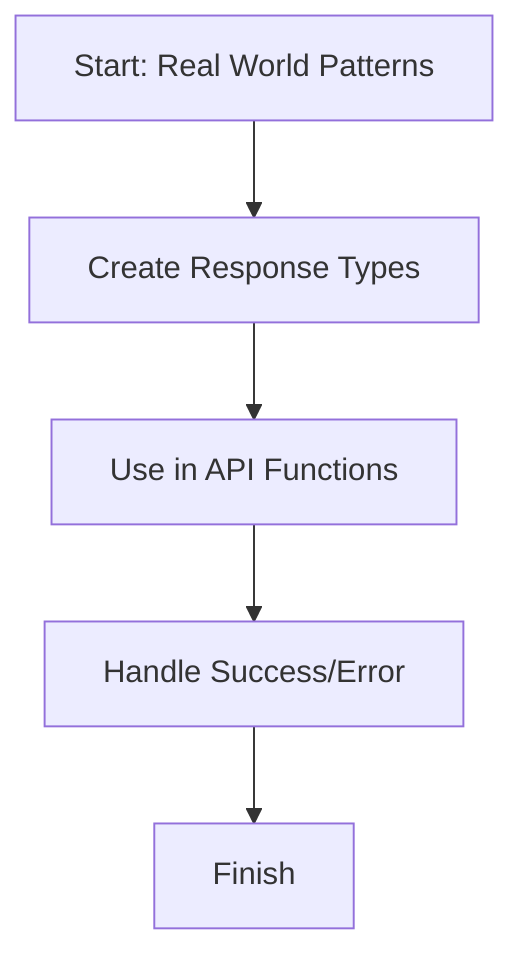

# 📖 Module 16: Real World Patterns

Learn how to combine TypeScript ideas into a production-ready API response pattern.

## 🎯 Topics Covered

- API response typing
- Reusable generic types
- Error handling with discriminated unions

## 🧠 Key Idea (Very Simple)

Real projects need consistent response shapes. TypeScript can enforce that safely.

## ❓ What Is It?

This module shows a common real-world pattern: wrapping API results in `success` or `error` objects with clear types.

## ✅ Why Use It?

- Prevent crashes by handling success/error explicitly.
- Reuse the same response structure across APIs.
- Keep code clean and predictable for teams.

## 🗺️ Lesson Flow



## 🧩 Full Example Code (From index.ts)

```ts
console.log("🚀 Starting Module 16: Real World Patterns...\n");

// PART 1: API Response Pattern & Types
{
	type SuccessResponse<T> = { ok: true; data: T; };
	type ErrorResponse = { ok: false; message: string; };
	type ApiResponse<T> = SuccessResponse<T> | ErrorResponse;

	type Product = { id: number; name: string; price: number; };

	function fetchProducts(simulateError: boolean): ApiResponse<Product[]> {
		if (simulateError) {
			return { ok: false, message: "Network Timeout: Could not load products" };
		}
		return {
			ok: true,
			data: [
				{ id: 1, name: "Keyboard", price: 1500 },
				{ id: 2, name: "Mouse", price: 700 }
			],
		};
	}

	function printResponse<T>(response: ApiResponse<T>): void {
		if (response.ok) {
			console.log("✅ Success! Data:", response.data);
		} else {
			console.log("❌ Error:", response.message);
		}
	}

	console.log("Testing Success Scenario:");
	printResponse(fetchProducts(false));

	console.log("\nTesting Error Scenario:");
	printResponse(fetchProducts(true));
	console.log("\n");
}

console.log("✅ Module 16 completed!\n");
```

## 📌 Quick Reference Table

| Pattern | Purpose | Example |
| --- | --- | --- |
| Success response | Return data safely | `{ ok: true, data: [...] }` |
| Error response | Return error message | `{ ok: false, message: "..." }` |
| Discriminated union | Safe branching by `ok` | `ApiResponse<T>` |

## ✅ Easy Breakdown (Super Simple)

### Step 1: Create response types

```ts
type SuccessResponse<T> = { ok: true; data: T; };
type ErrorResponse = { ok: false; message: string; };
type ApiResponse<T> = SuccessResponse<T> | ErrorResponse;
```

### Step 2: Return one of the two shapes

```ts
if (simulateError) {
	return { ok: false, message: "Network Timeout: Could not load products" };
}
return { ok: true, data: [...] };
```

### Step 3: Narrow safely with `ok`

```ts
if (response.ok) {
	console.log(response.data);
} else {
	console.log(response.message);
}
```

## 🧪 Small Practice

Add one more `Product` field named `category` and update all related types.

## 🚀 Run This Lesson

```bash
npm run build
node dist/16_real_world_patterns/index.js
```
